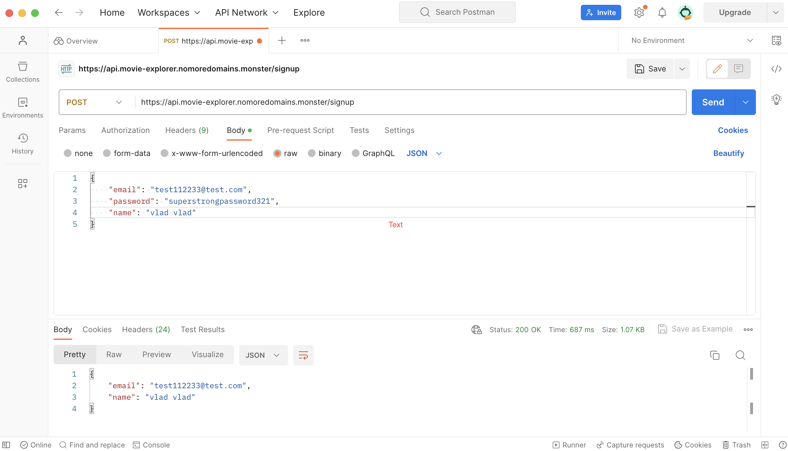

# Movies Explorer API
This is the backend part (API) of the final project of the web development course.  
It contains a few [endpoints](#available-requests) to handle user registration, login and logout, adding movies to favorites, or removing them from favorites.  

The frontend part can be found <a href="https://github.com/vlad-lis/movies-explorer-frontend" target="_blank">here</a>.

Here is a sample test of the /signup endpoint conducted via Postman:
 


## Repository and address 
* Public address: https://api.movie-explorer.nomoredomains.monster/  

* Public IP: 158.160.39.63

To run locally see [instructions](#run-locally) below.


## Available requests
* **POST /signup**  
Creates a new user; expects the request body with 'email', 'password', and 'name'.  

* **POST /signin**  
Checks the request body with 'email' and 'password' and returns a JWT.  

* **POST /signout** 
Removes the JWT from cookies.  

* **GET /users/me** 
Returns the current user's information.  

* **PATCH /users/me**  
Edits the current user's information; expects the request body with 'email' and 'name'.  

* **GET /movies**  
Returns all movies saved by the current user.  

* **POST /movies**  
Saves a movie to the database; expects the request body with 'country', 'director', 'duration', 'year', 'description', 'image', 'trailer', 'nameRU', 'nameEN', 'thumbnail', and 'movieId'.  

* **DELETE /movies/_id**  
Deletes a saved movie by its ID; expects the ID to be a hexadecimal string with a length of 24 characters.

## Run locally
1. Clone repository.
2. Install dependencies (```$npm i```)
3. While in the local repository run ```$npm run start``` or ```$npm run dev``` (hot reload).
4. To configure the port, database and jwt settings create an .env file in root directory.  
   (.env template can be found in .env.template file)
